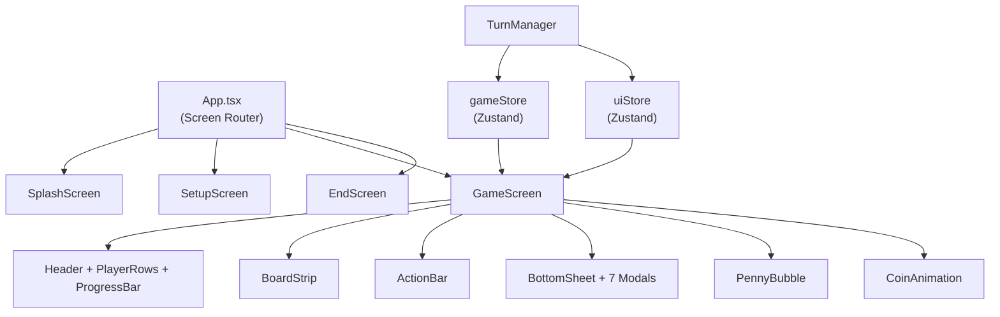

# KidCapital — Week 2 Walkthrough

## What Was Built

Full playable game loop: splash → setup → roll dice → move → resolve space → show modal → next turn → bot plays → win screen.

### Architecture

### Files Created (30 files)

| Category | Files |
|----------|-------|
| Stores | [gameStore.ts](file:///home/marc/code/MarcoBlch/Kidcapital/src/store/gameStore.ts), [uiStore.ts](file:///home/marc/code/MarcoBlch/Kidcapital/src/store/uiStore.ts) |
| Screens | [SplashScreen](file:///home/marc/code/MarcoBlch/Kidcapital/src/screens/SplashScreen.tsx), [SetupScreen](file:///home/marc/code/MarcoBlch/Kidcapital/src/screens/SetupScreen.tsx), [GameScreen](file:///home/marc/code/MarcoBlch/Kidcapital/src/screens/GameScreen.tsx), [EndScreen](file:///home/marc/code/MarcoBlch/Kidcapital/src/screens/EndScreen.tsx) |
| Board | [BoardStrip](file:///home/marc/code/MarcoBlch/Kidcapital/src/components/board/BoardStrip.tsx), [SpaceCard](file:///home/marc/code/MarcoBlch/Kidcapital/src/components/board/SpaceCard.tsx), [PlayerToken](file:///home/marc/code/MarcoBlch/Kidcapital/src/components/board/PlayerToken.tsx) |
| HUD | [Header](file:///home/marc/code/MarcoBlch/Kidcapital/src/components/hud/Header.tsx), [PlayerRow](file:///home/marc/code/MarcoBlch/Kidcapital/src/components/hud/PlayerRow.tsx), [ProgressBar](file:///home/marc/code/MarcoBlch/Kidcapital/src/components/hud/ProgressBar.tsx), [ActionBar](file:///home/marc/code/MarcoBlch/Kidcapital/src/components/hud/ActionBar.tsx) |
| Dice | [DiceRoller](file:///home/marc/code/MarcoBlch/Kidcapital/src/components/dice/DiceRoller.tsx) |
| Engine | [TurnManager](file:///home/marc/code/MarcoBlch/Kidcapital/src/engine/TurnManager.ts) |
| Modals | [BottomSheet](file:///home/marc/code/MarcoBlch/Kidcapital/src/components/modals/BottomSheet.tsx), [InvestModal](file:///home/marc/code/MarcoBlch/Kidcapital/src/components/modals/InvestModal.tsx), [PaydayModal](file:///home/marc/code/MarcoBlch/Kidcapital/src/components/modals/PaydayModal.tsx), [LifeEventModal](file:///home/marc/code/MarcoBlch/Kidcapital/src/components/modals/LifeEventModal.tsx), [HustleModal](file:///home/marc/code/MarcoBlch/Kidcapital/src/components/modals/HustleModal.tsx), [TemptationModal](file:///home/marc/code/MarcoBlch/Kidcapital/src/components/modals/TemptationModal.tsx), [ChallengeModal](file:///home/marc/code/MarcoBlch/Kidcapital/src/components/modals/ChallengeModal.tsx), [BankModal](file:///home/marc/code/MarcoBlch/Kidcapital/src/components/modals/BankModal.tsx) |
| Penny | [PennyBubble](file:///home/marc/code/MarcoBlch/Kidcapital/src/components/penny/PennyBubble.tsx) |
| UI | [Button](file:///home/marc/code/MarcoBlch/Kidcapital/src/components/ui/Button.tsx), [CoinAnimation](file:///home/marc/code/MarcoBlch/Kidcapital/src/components/ui/CoinAnimation.tsx) |

### Key Design Decisions

- **TurnManager uses `getState()`** not closures — avoids stale state per MEMORY.md pitfall
- **Step-by-step movement** — token moves 1 space at a time with 120ms delay
- **Bot AI per personality** — Conservative (cash only, cheapest), Aggressive (loans ok, highest ROI), Balanced (best ROI ratio)
- **BottomSheet** — Reusable wrapper for all 7 modal types with accent color stripe
- **PaydayModal** — Full income statement layout (income/expenses/net) — the key educational moment

## Verification Results

| Check | Result |
|-------|--------|
| `npx tsc --noEmit` | ✅ 0 errors |
| `npx vitest run` | ✅ 44/44 tests pass |
| `npm run build` | ✅ 467 modules, 373KB JS, 31KB CSS |
| Dev server | ✅ Runs on localhost:5173 |

> [!NOTE]
> Browser tool was unavailable for visual testing. Run `npm run dev` to test the full game flow visually.

## Ready for Next Steps

- Polish Tailwind classes for mobile spacing
- Sound effects integration
- LocalStorage persistence
- Penny AI (Gemini API) integration for premium tier
